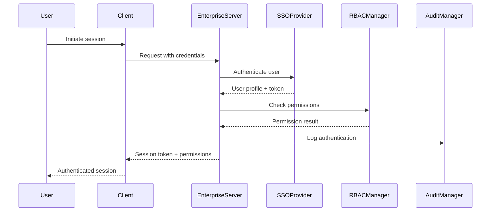

# Enterprise Console Automation MCP - Architecture Guide

## Overview

This document outlines the enterprise-grade enhancements added to the Console Automation MCP, transforming it from a basic console automation tool into a comprehensive enterprise platform suitable for large organizations with strict security, compliance, and governance requirements.

## Table of Contents

1. [Enterprise Architecture Overview](#enterprise-architecture-overview)
2. [Core Components](#core-components)
3. [Security & Authentication](#security--authentication)
4. [Compliance & Governance](#compliance--governance)
5. [Change Management](#change-management)
6. [Secret Management](#secret-management)
7. [Enterprise Integrations](#enterprise-integrations)
8. [Deployment Architecture](#deployment-architecture)
9. [Configuration Guide](#configuration-guide)
10. [Compliance Standards](#compliance-standards)

## Enterprise Architecture Overview

The enterprise-enhanced Console Automation MCP provides a comprehensive platform for managing console operations with enterprise-grade security, compliance, and governance features.

### Key Enterprise Features

- **Role-Based Access Control (RBAC)** with fine-grained permissions
- **Single Sign-On (SSO)** with OIDC, SAML, and LDAP support
- **Comprehensive Audit Trails** for SOC2, HIPAA, PCI-DSS, and ISO27001 compliance
- **Enterprise Secret Management** with Vault, AWS Secrets Manager, Azure Key Vault, and GCP Secret Manager
- **ITIL-Compliant Change Management** with approval workflows
- **Multi-Team Collaboration** with hierarchical permissions
- **Enterprise Tool Integration** (ServiceNow, JIRA, Slack, etc.)
- **Disaster Recovery and Backup** capabilities
- **Zero-Trust Security Model**

### Architecture Layers

```
┌─────────────────────────────────────────────────────────────────┐
│                      Presentation Layer                        │
│  ┌─────────────────┐  ┌─────────────────┐  ┌─────────────────┐ │
│  │   Web Dashboard │  │   CLI Interface │  │   API Gateway   │ │
│  └─────────────────┘  └─────────────────┘  └─────────────────┘ │
├─────────────────────────────────────────────────────────────────┤
│                     Enterprise Services Layer                  │
│  ┌─────────────────┐  ┌─────────────────┐  ┌─────────────────┐ │
│  │ Change Mgmt     │  │ Compliance      │  │ Integration Hub │ │
│  └─────────────────┘  └─────────────────┘  └─────────────────┘ │
│  ┌─────────────────┐  ┌─────────────────┐  ┌─────────────────┐ │
│  │ Secret Mgmt     │  │ Governance      │  │ Backup & DR     │ │
│  └─────────────────┘  └─────────────────┘  └─────────────────┘ │
├─────────────────────────────────────────────────────────────────┤
│                     Security & Identity Layer                  │
│  ┌─────────────────┐  ┌─────────────────┐  ┌─────────────────┐ │
│  │ SSO Manager     │  │ RBAC Manager    │  │ Audit Manager   │ │
│  └─────────────────┘  └─────────────────┘  └─────────────────┘ │
├─────────────────────────────────────────────────────────────────┤
│                        Core Console Layer                      │
│  ┌─────────────────┐  ┌─────────────────┐  ┌─────────────────┐ │
│  │ Console Manager │  │ Stream Manager  │  │ Error Detector  │ │
│  └─────────────────┘  └─────────────────┘  └─────────────────┘ │
├─────────────────────────────────────────────────────────────────┤
│                     Infrastructure Layer                       │
│  ┌─────────────────┐  ┌─────────────────┐  ┌─────────────────┐ │
│  │ Database        │  │ Message Queue   │  │ File Storage    │ │
│  └─────────────────┘  └─────────────────┘  └─────────────────┘ │
└─────────────────────────────────────────────────────────────────┘
```

## Core Components

### 1. Enterprise Console Automation Server
**File**: `src/enterprise/server/EnterpriseConsoleAutomationServer.ts`

Main server class that orchestrates all enterprise components and provides the MCP interface with enhanced security and governance features.

**Key Features**:
- Integrates all enterprise components
- Provides comprehensive MCP tool interface
- Handles authentication and authorization
- Manages enterprise session creation with compliance tracking

### 2. Role-Based Access Control (RBAC) Manager
**File**: `src/enterprise/auth/RBACManager.ts`

Comprehensive RBAC system with hierarchical roles, fine-grained permissions, and resource constraints.

**Features**:
- Hierarchical role inheritance
- Resource-level permissions with constraints
- Permission caching for performance
- Team-based access control
- Policy evaluation engine

**Permission Model**:
```typescript
interface Permission {
  id: string;
  resource: string;        // e.g., 'console:session'
  action: string;          // e.g., 'create', 'read', 'write'
  constraints?: {          // Fine-grained access control
    type: 'regex' | 'exact' | 'prefix';
    field: string;         // e.g., 'command', 'cwd'
    value: string;
    negate?: boolean;
  }[];
}
```

### 3. Single Sign-On (SSO) Manager
**File**: `src/enterprise/auth/SSOManager.ts`

Multi-provider SSO integration supporting enterprise identity systems.

**Supported Providers**:
- **OpenID Connect (OIDC)**: Azure AD, Okta, Auth0
- **SAML 2.0**: Enterprise SAML providers
- **LDAP/Active Directory**: On-premises directory services

**Features**:
- JWT token management
- Session management with timeout
- Multi-factor authentication support
- Provider failover and load balancing

### 4. Audit Manager
**File**: `src/enterprise/audit/AuditManager.ts`

Comprehensive audit trail system for compliance and security monitoring.

**Features**:
- Real-time audit logging
- Compliance rule engine (SOC2, HIPAA, PCI-DSS, ISO27001)
- Tamper-proof audit trails with integrity hashing
- Multiple output formats (JSON, CEF, LEEF)
- Automated compliance reporting
- Risk-based event scoring

**Compliance Rules Engine**:
```typescript
interface ComplianceRule {
  id: string;
  name: string;
  standard: 'SOC2' | 'HIPAA' | 'PCI-DSS' | 'ISO27001';
  type: 'preventive' | 'detective' | 'corrective';
  conditions: ComplianceCondition[];
  actions: ComplianceAction[];
}
```

### 5. Secret Manager
**File**: `src/enterprise/secrets/SecretManager.ts`

Multi-provider secret management with rotation and audit capabilities.

**Supported Providers**:
- **HashiCorp Vault**: Industry-standard secret management
- **AWS Secrets Manager**: Cloud-native AWS solution
- **Azure Key Vault**: Microsoft Azure secret storage
- **GCP Secret Manager**: Google Cloud Platform secrets

**Features**:
- Provider failover and priority ordering
- Secret rotation policies
- Access auditing and monitoring
- Encryption at rest and in transit
- Integration with enterprise HSMs

### 6. Change Manager
**File**: `src/enterprise/change/ChangeManager.ts`

ITIL-compliant change management system with approval workflows.

**Features**:
- Standard, Normal, and Emergency change workflows
- Multi-level approval chains with escalation
- Change Advisory Board (CAB) integration
- Risk assessment and impact analysis
- Change calendar and blackout periods
- Rollback planning and execution

**Change Workflow Example**:
```typescript
const standardWorkflow = {
  steps: [
    { type: 'review', reviewers: ['tech-lead'], timeoutHours: 24 },
    { type: 'approval', approvers: ['manager'], timeoutHours: 24 },
    { type: 'approval', approvers: ['cab'], timeoutHours: 72 }
  ]
};
```

## Security & Authentication

### Zero-Trust Security Model

The enterprise architecture implements a zero-trust security model where:

1. **Every request is authenticated** using SSO tokens
2. **Every action is authorized** through RBAC policies
3. **Every operation is audited** for compliance
4. **All data is encrypted** at rest and in transit
5. **Network access is segmented** and monitored

### Authentication Flow



### Session Security

- **JWT tokens** with configurable expiration
- **Session rotation** to prevent token hijacking
- **Concurrent session limits** per user
- **Geolocation tracking** for anomaly detection
- **Device fingerprinting** for additional security

## Compliance & Governance

### Supported Compliance Standards

#### SOC 2 Type II
- **Access Controls**: All access logged and monitored
- **System Operations**: Comprehensive change management
- **Logical and Physical Access**: RBAC with segregation of duties
- **System Monitoring**: Real-time security monitoring

#### HIPAA (Healthcare)
- **Administrative Safeguards**: Role-based access controls
- **Physical Safeguards**: Audit trails for all data access
- **Technical Safeguards**: Encryption and access controls
- **Audit Controls**: Comprehensive logging and monitoring

#### PCI DSS (Payment Card Industry)
- **Build and Maintain Secure Networks**: Network segmentation
- **Protect Cardholder Data**: Encryption and access controls
- **Maintain Vulnerability Management**: Continuous monitoring
- **Implement Strong Access Control**: Multi-factor authentication
- **Regularly Monitor and Test Networks**: Audit trails and testing
- **Maintain Information Security Policy**: Governance framework

#### ISO 27001 (Information Security)
- **Security Policy**: Comprehensive governance framework
- **Organization of Information Security**: Role definitions
- **Human Resource Security**: Background checks and training
- **Asset Management**: Configuration management
- **Access Control**: RBAC and privileged access management

### Governance Framework

```typescript
interface GovernancePolicy {
  id: string;
  name: string;
  type: 'access' | 'usage' | 'security' | 'compliance';
  scope: 'global' | 'team' | 'user' | 'resource';
  conditions: PolicyCondition[];
  actions: PolicyAction[];
  effectiveDate: Date;
  expiryDate?: Date;
}
```

**Policy Types**:
- **Access Policies**: Control who can access what resources
- **Usage Policies**: Define how resources can be used
- **Security Policies**: Enforce security requirements
- **Compliance Policies**: Ensure regulatory compliance

## Change Management

### ITIL-Aligned Processes

The change management system follows ITIL best practices:

#### Change Categories
1. **Standard Changes**: Pre-approved, low-risk changes
2. **Normal Changes**: Require CAB approval
3. **Emergency Changes**: Fast-track for urgent fixes

#### Approval Workflows

```typescript
const normalChangeWorkflow = {
  steps: [
    {
      name: 'Business Impact Review',
      type: 'review',
      reviewers: ['business-analyst'],
      timeoutHours: 48
    },
    {
      name: 'Technical Review', 
      type: 'review',
      reviewers: ['architect'],
      timeoutHours: 48
    },
    {
      name: 'Security Review',
      type: 'review', 
      reviewers: ['security-team'],
      timeoutHours: 72
    },
    {
      name: 'CAB Approval',
      type: 'approval',
      approvers: ['cab-members'],
      timeoutHours: 72
    }
  ]
};
```

#### Risk Assessment

Automated risk scoring based on:
- **Business Impact**: Low, Medium, High, Critical
- **Technical Risk**: System dependencies and complexity
- **Rollback Complexity**: Recovery procedures
- **Affected Systems**: Critical infrastructure involvement
- **Change Type**: Emergency changes carry higher risk

### Integration with Console Operations

Console sessions can be linked to approved changes:
```typescript
const sessionOptions = {
  command: 'systemctl restart nginx',
  changeRequestId: 'CHG_12345',
  businessJustification: 'Fix critical security vulnerability',
  riskLevel: 'high',
  recordingEnabled: true,
  maxDuration: 3600000 // 1 hour limit
};
```

## Secret Management

### Multi-Provider Architecture

The secret management system supports multiple providers with automatic failover:

```typescript
const secretConfig = {
  providers: [
    {
      type: 'vault',
      name: 'primary-vault',
      priority: 1,
      config: {
        address: 'https://vault.company.com:8200',
        mountPoint: 'secret',
        roleId: 'role-id',
        secretId: 'secret-id'
      }
    },
    {
      type: 'aws-secrets',
      name: 'aws-backup',
      priority: 2,
      config: {
        region: 'us-east-1',
        roleArn: 'arn:aws:iam::account:role/SecretsRole'
      }
    }
  ]
};
```

### Secret Rotation Policies

Automated secret rotation with customizable policies:

```typescript
const rotationPolicy = {
  enabled: true,
  interval: 90, // days
  notifyBefore: 7, // days before expiry
  autoRotate: true,
  rotationScript: './scripts/rotate-database-password.sh'
};
```

### Integration with Console Sessions

Secrets can be injected into console sessions securely:
```bash
# Instead of hardcoded passwords:
mysql -u admin -p'hardcoded-password'

# Use secret injection:
mysql -u admin -p'{{secret:database/mysql/admin-password}}'
```

## Enterprise Integrations

### Supported Integration Types

#### ServiceNow
- **Change Requests**: Automatic creation and updates
- **Incident Management**: Link console operations to incidents
- **Configuration Management**: CMDB integration

#### JIRA
- **Issue Tracking**: Link console operations to tickets
- **Workflow Integration**: Approval workflows
- **Reporting**: Change metrics and compliance reports

#### Slack/Microsoft Teams
- **Notifications**: Real-time alerts and approvals
- **ChatOps**: Approve changes through chat
- **Status Updates**: Automated status notifications

#### PagerDuty
- **Incident Response**: Emergency change notifications
- **On-Call Integration**: Route approvals to on-call engineers
- **Escalation Management**: Automated escalation policies

### Integration Configuration

```typescript
const integrations = [
  {
    type: 'servicenow',
    name: 'Production ServiceNow',
    config: {
      baseUrl: 'https://company.service-now.com',
      username: 'integration-user',
      password: '{{secret:integrations/servicenow/password}}'
    },
    triggers: [
      {
        event: 'change:created',
        template: 'Change Request {{changeId}} created: {{title}}'
      }
    ]
  }
];
```

## Deployment Architecture

### High-Availability Deployment

```yaml
# docker-compose.yml for enterprise deployment
version: '3.8'
services:
  enterprise-mcp:
    image: enterprise-console-automation:latest
    deploy:
      replicas: 3
      resources:
        limits:
          memory: 2G
          cpus: '1.0'
    environment:
      - SSO_ENABLED=true
      - RBAC_ENABLED=true
      - AUDIT_ENABLED=true
      - SECRETS_ENABLED=true
      - CHANGE_MGMT_ENABLED=true
    volumes:
      - ./config:/app/config
      - ./logs:/app/logs
      - ./certs:/app/certs
    networks:
      - enterprise-network

  vault:
    image: vault:1.15
    ports:
      - "8200:8200"
    environment:
      - VAULT_DEV_ROOT_TOKEN_ID=root
    networks:
      - enterprise-network

  postgresql:
    image: postgresql:15
    environment:
      - POSTGRES_DB=enterprise_mcp
      - POSTGRES_USER=mcp_user
      - POSTGRES_PASSWORD_FILE=/run/secrets/db_password
    secrets:
      - db_password
    networks:
      - enterprise-network

networks:
  enterprise-network:
    driver: overlay
    encrypted: true

secrets:
  db_password:
    file: ./secrets/db_password.txt
```

### Network Security

```
┌─────────────────────────────────────────────────────────────┐
│                     DMZ Network                             │
│  ┌─────────────────┐    ┌─────────────────┐               │
│  │   Load Balancer │────│   API Gateway   │               │
│  └─────────────────┘    └─────────────────┘               │
└─────────────────┬───────────────────────────────────────────┘
                  │
┌─────────────────┼───────────────────────────────────────────┐
│                 │        Application Network                │
│  ┌─────────────────┐    ┌─────────────────┐               │
│  │ Enterprise MCP  │────│   Message Queue │               │
│  │    Cluster      │    │   (Redis/NATS)  │               │
│  └─────────────────┘    └─────────────────┘               │
└─────────────────┬───────────────────────────────────────────┘
                  │
┌─────────────────┼───────────────────────────────────────────┐
│                 │         Data Network                      │
│  ┌─────────────────┐    ┌─────────────────┐               │
│  │   PostgreSQL    │    │   Vault Cluster │               │
│  │    Cluster      │    │                 │               │
│  └─────────────────┘    └─────────────────┘               │
└─────────────────────────────────────────────────────────────┘
```

### Security Hardening

1. **Network Segmentation**: Separate networks for different tiers
2. **TLS Everywhere**: All communication encrypted with TLS 1.3
3. **Certificate Management**: Automated certificate rotation
4. **Secret Management**: No secrets in configuration files
5. **Container Security**: Distroless base images, non-root users
6. **Monitoring**: Comprehensive security monitoring and alerting

## Configuration Guide

### Environment Variables

```bash
# Core Configuration
MCP_PORT=8080
MCP_HOST=0.0.0.0
LOG_LEVEL=info

# Security
JWT_SECRET=your-jwt-secret-here
ENCRYPTION_KEY=your-encryption-key-here
SECRET_ENCRYPTION_KEY=your-secret-key-here

# SSO Configuration
SSO_ENABLED=true
SSO_OIDC_ISSUER=https://login.microsoftonline.com/tenant-id/v2.0
SSO_OIDC_CLIENT_ID=your-client-id
SSO_OIDC_CLIENT_SECRET=your-client-secret
SSO_SESSION_TIMEOUT=28800

# RBAC Configuration
RBAC_ENABLED=true
RBAC_DEFAULT_ROLE=console:viewer
RBAC_ADMIN_USERS=admin@company.com,security@company.com

# Audit Configuration
AUDIT_ENABLED=true
AUDIT_RETENTION_DAYS=2555  # 7 years
AUDIT_ENCRYPTION_ENABLED=true

# Secret Management
SECRETS_ENABLED=true
VAULT_ADDR=https://vault.company.com:8200
VAULT_ROLE_ID=your-role-id
VAULT_SECRET_ID=your-secret-id

# Change Management
CHANGE_MGMT_ENABLED=true
CHANGE_DEFAULT_APPROVERS=manager@company.com,architect@company.com
CHANGE_EMERGENCY_BYPASS=false

# Database
DB_HOST=postgresql.company.com
DB_PORT=5432
DB_NAME=enterprise_mcp
DB_USER=mcp_user
DB_PASSWORD_FILE=/run/secrets/db_password
```

### Configuration File Structure

```yaml
# config/enterprise.yaml
enterprise:
  rbac:
    enabled: true
    defaultRole: "console:viewer"
    inheritanceEnabled: true
    cacheTimeout: 3600
    adminUsers:
      - "admin@company.com"
      - "security@company.com"

  sso:
    enabled: true
    providers:
      - name: "azure-ad"
        type: "oidc"
        isDefault: true
        config:
          issuer: "https://login.microsoftonline.com/tenant-id/v2.0"
          clientId: "${SSO_OIDC_CLIENT_ID}"
          clientSecret: "${SSO_OIDC_CLIENT_SECRET}"
          redirectUri: "https://mcp.company.com/auth/callback"
          scopes: ["openid", "profile", "email", "groups"]

  audit:
    enabled: true
    retentionDays: 2555
    destinations:
      - "database"
      - "elasticsearch"
      - "splunk"
    encryptionEnabled: true
    tamperProtection: true
    realTimeAnalysis: true

  secrets:
    enabled: true
    providers:
      - name: "primary-vault"
        type: "vault"
        priority: 1
        config:
          address: "${VAULT_ADDR}"
          roleId: "${VAULT_ROLE_ID}"
          secretId: "${VAULT_SECRET_ID}"
          mountPoint: "secret"
      - name: "aws-backup"
        type: "aws-secrets"
        priority: 2
        config:
          region: "us-east-1"
          roleArn: "arn:aws:iam::account:role/SecretsRole"
    cacheTimeout: 300
    rotationEnabled: true
    auditAccess: true

  changeManagement:
    enabled: true
    defaultApprovers:
      - "manager@company.com"
      - "architect@company.com"
    emergencyBypass: false
    integrationEnabled: true
    notificationChannels:
      - "email"
      - "slack"

  integrations:
    enabled: true
    integrations:
      - type: "servicenow"
        name: "Production ServiceNow"
        config:
          baseUrl: "https://company.service-now.com"
          username: "integration-user"
          password: "{{secret:integrations/servicenow/password}}"
        triggers:
          - event: "change:created"
            template: "Change Request {{changeId}} created: {{title}}"
      - type: "slack"
        name: "Operations Slack"
        config:
          webhookUrl: "{{secret:integrations/slack/webhook-url}}"
        triggers:
          - event: "compliance:violation"
            template: "🚨 Compliance Violation: {{violation.description}}"

  governance:
    enabled: true
    enforcementMode: "enforcing"  # or "advisory"
    appealProcess: true
    policies:
      - id: "production-access"
        name: "Production Access Policy"
        type: "access"
        scope: "global"
        conditions:
          - field: "environment"
            operator: "equals"
            value: "production"
        actions:
          - type: "require_approval"
            parameters:
              approvers: ["production-admin"]
              timeoutHours: 2

  monitoring:
    enabled: true
    metricsRetention: 30
    dashboardEnabled: true
    exporters:
      - "prometheus"
      - "datadog"
    alertRules:
      - id: "high-risk-sessions"
        name: "High Risk Sessions"
        metric: "session.risk_level"
        conditions:
          - operator: "equals"
            value: "critical"
        actions:
          - type: "slack"
            config:
              channel: "#security-alerts"
```

## Compliance Standards

### SOC 2 Type II Compliance

The enterprise architecture addresses all five Trust Service Criteria:

#### Security (CC1-CC8)
- **CC1.1**: COSO Framework Implementation
- **CC2.1**: Communication of Entity's Commitment to Integrity and Ethical Values
- **CC3.1**: Board Independence and Operating Effectiveness
- **CC4.1**: Entity Commitment to Competence
- **CC5.1**: Individual Performance and Accountability
- **CC6.1**: Logical and Physical Access Controls (RBAC + SSO)
- **CC7.1**: System Operation (Change Management)
- **CC8.1**: Change Management (Version Control + Approvals)

#### Availability (A1)
- **A1.1**: Performance Monitoring
- **A1.2**: Backup and Recovery
- **A1.3**: System Monitoring

#### Processing Integrity (PI1)
- **PI1.1**: System Processing
- **PI1.2**: Data Processing Accuracy

#### Confidentiality (C1)
- **C1.1**: Confidential Information Protection
- **C1.2**: Disposal of Confidential Information

#### Privacy (P1-P8)
- **P1.1**: Privacy Notice and Consent
- **P2.1**: Collection and Processing
- **P3.1**: Choice and Consent
- **P4.1**: Collection Limitation
- **P5.1**: Use and Retention
- **P6.1**: Disclosure to Third Parties
- **P7.1**: Access Rights
- **P8.1**: Data Quality

### HIPAA Compliance

For healthcare organizations, the system provides:

#### Administrative Safeguards
- **164.308(a)(1)**: Security Officer designation
- **164.308(a)(2)**: Assigned security responsibility
- **164.308(a)(3)**: Workforce training and access management
- **164.308(a)(4)**: Information access management procedures
- **164.308(a)(5)**: Security awareness and training
- **164.308(a)(6)**: Security incident procedures
- **164.308(a)(7)**: Contingency plan
- **164.308(a)(8)**: Evaluation procedures

#### Physical Safeguards
- **164.310(a)(1)**: Facility access controls
- **164.310(a)(2)**: Workstation use restrictions
- **164.310(d)(1)**: Device and media controls

#### Technical Safeguards
- **164.312(a)(1)**: Access control (RBAC implementation)
- **164.312(b)**: Audit controls (comprehensive audit logging)
- **164.312(c)(1)**: Integrity controls
- **164.312(d)**: Person or entity authentication (SSO)
- **164.312(e)(1)**: Transmission security (TLS encryption)

### Audit Evidence Generation

The system automatically generates audit evidence for compliance:

```typescript
// Example audit evidence for SOC 2
const auditEvidence = {
  control: "CC6.1 - Logical Access Controls",
  evidence: [
    {
      type: "system_configuration",
      description: "RBAC policies and role assignments",
      file: "rbac-configuration.json",
      timestamp: "2024-01-15T10:00:00Z"
    },
    {
      type: "access_logs", 
      description: "User access attempts and authorizations",
      query: "SELECT * FROM audit_events WHERE action LIKE 'rbac_%'",
      period: "2024-01-01 to 2024-01-31"
    },
    {
      type: "policy_documentation",
      description: "Documented access control procedures",
      document: "Access-Control-Policy-v2.1.pdf"
    }
  ]
};
```

## Getting Started

### 1. Basic Setup

```bash
# Clone the repository
git clone https://github.com/company/enterprise-console-automation
cd enterprise-console-automation

# Install dependencies
npm install

# Build the project
npm run build

# Copy example configuration
cp config/enterprise.example.yaml config/enterprise.yaml
```

### 2. Configure Enterprise Features

Edit `config/enterprise.yaml` to match your environment:

```yaml
enterprise:
  rbac:
    enabled: true
    adminUsers: ["your-admin@company.com"]
  
  sso:
    enabled: true
    providers:
      - name: "your-sso-provider"
        type: "oidc"
        config:
          issuer: "https://your-identity-provider"
          clientId: "your-client-id"
          clientSecret: "${SSO_CLIENT_SECRET}"
  
  audit:
    enabled: true
    retentionDays: 365
    
  secrets:
    enabled: true
    providers:
      - name: "vault"
        type: "vault"
        config:
          address: "https://your-vault-instance"
```

### 3. Set Environment Variables

```bash
export JWT_SECRET="your-secure-jwt-secret"
export ENCRYPTION_KEY="your-encryption-key"
export SSO_CLIENT_SECRET="your-sso-client-secret"
export VAULT_TOKEN="your-vault-token"
```

### 4. Start the Enterprise Server

```bash
# Development mode
npm run dev

# Production mode
npm start

# With Docker
docker-compose up -d
```

### 5. Verify Installation

```bash
# Check server health
curl http://localhost:8080/health

# Test authentication
curl -X POST http://localhost:8080/auth/login \
  -H "Content-Type: application/json" \
  -d '{"provider": "azure-ad", "credentials": {...}}'

# Test RBAC
curl -X POST http://localhost:8080/rbac/check-access \
  -H "Authorization: Bearer your-jwt-token" \
  -H "Content-Type: application/json" \
  -d '{"action": "create", "resource": "console:session"}'
```

## Monitoring and Observability

### Metrics Collection

The enterprise server exposes comprehensive metrics:

```javascript
// Prometheus metrics endpoint
GET /metrics

// Custom metrics
enterprise_mcp_sessions_total{user="john.doe",risk_level="high"} 15
enterprise_mcp_audit_events_total{outcome="success",compliance_flag="SOC2"} 1234
enterprise_mcp_rbac_checks_total{granted="true",resource="console:session"} 567
enterprise_mcp_secrets_requests_total{provider="vault",operation="read"} 89
enterprise_mcp_changes_total{status="approved",type="normal"} 23
```

### Health Checks

```javascript
// Health check endpoint
GET /health

{
  "status": "healthy",
  "components": {
    "console": "healthy",
    "sso": "healthy", 
    "rbac": "healthy",
    "audit": "healthy",
    "secrets": "healthy",
    "changeManagement": "healthy"
  },
  "metrics": {
    "activeSessions": 42,
    "ssoSessions": 156,
    "auditEvents": 12456,
    "secretProviders": 2
  }
}
```

### Alerting Rules

Example Prometheus alerting rules:

```yaml
groups:
  - name: enterprise-mcp.rules
    rules:
      - alert: HighRiskSessionsExceeded
        expr: rate(enterprise_mcp_sessions_total{risk_level="critical"}[5m]) > 0.1
        for: 2m
        labels:
          severity: warning
          component: console
        annotations:
          summary: "High number of critical risk sessions"
          description: "{{ $value }} critical risk sessions created in the last 5 minutes"

      - alert: ComplianceViolationDetected
        expr: increase(enterprise_mcp_audit_events_total{outcome="violation"}[1m]) > 0
        for: 0s
        labels:
          severity: critical
          component: audit
        annotations:
          summary: "Compliance violation detected"
          description: "A compliance violation has been detected and requires immediate attention"

      - alert: SecretProviderUnavailable
        expr: enterprise_mcp_secret_provider_available == 0
        for: 1m
        labels:
          severity: critical
          component: secrets
        annotations:
          summary: "Secret provider unavailable"
          description: "Secret provider {{ $labels.provider }} is unavailable"
```

## Summary

This enterprise-enhanced Console Automation MCP provides a comprehensive platform for large organizations requiring:

- **Enterprise Security**: Multi-provider SSO, comprehensive RBAC, and zero-trust architecture
- **Regulatory Compliance**: Built-in support for SOC 2, HIPAA, PCI-DSS, and ISO 27001
- **Operational Excellence**: ITIL-compliant change management and comprehensive audit trails
- **Scalability**: High-availability deployment with horizontal scaling
- **Integration**: Native integration with enterprise tools and systems

The architecture supports organizations from hundreds to thousands of users with strict security, compliance, and governance requirements while maintaining the flexibility and usability of the original console automation capabilities.

### Key Benefits

1. **Risk Reduction**: Comprehensive audit trails and compliance automation reduce regulatory risk
2. **Operational Efficiency**: Automated workflows and integrated change management streamline operations
3. **Security Posture**: Multi-layered security with SSO, RBAC, and continuous monitoring
4. **Compliance Automation**: Built-in compliance rules and automated reporting reduce audit burden
5. **Enterprise Integration**: Native integration with existing enterprise tools and workflows
6. **Scalability**: Cloud-native architecture supports growth from small teams to large enterprises

This enterprise architecture transforms the Console Automation MCP from a simple automation tool into a comprehensive enterprise platform suitable for the most demanding organizational requirements.